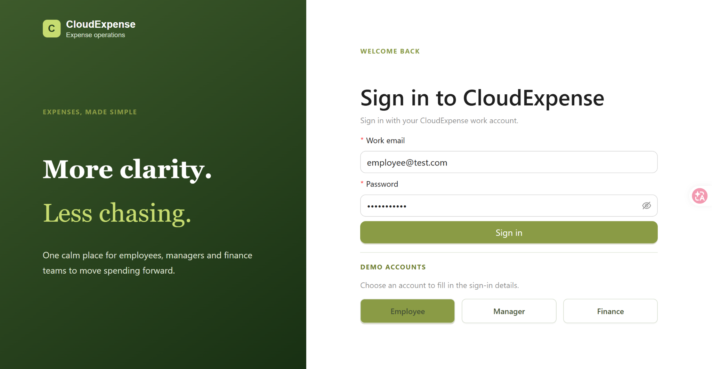
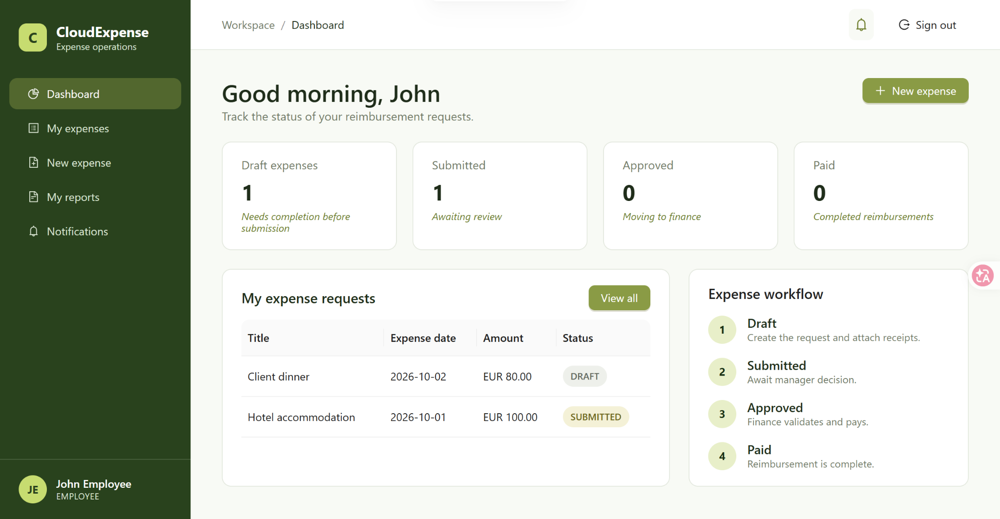
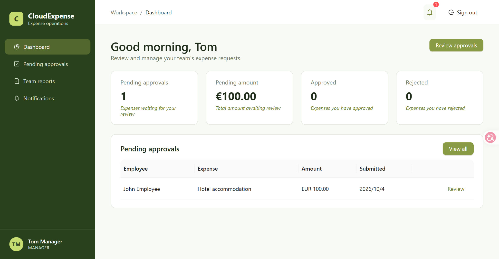
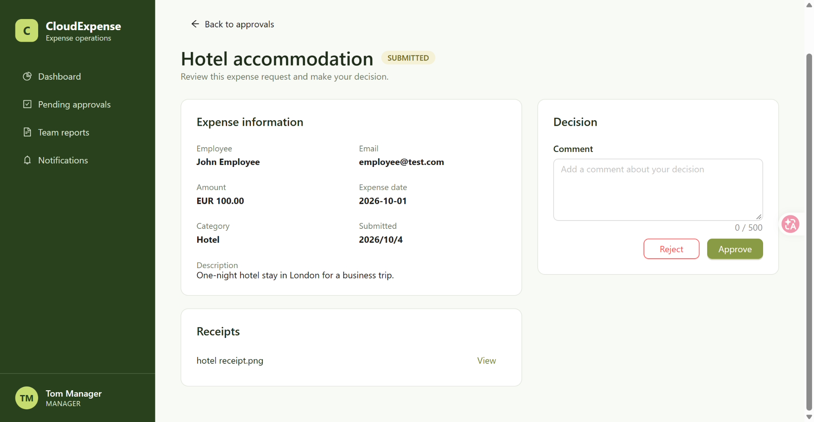
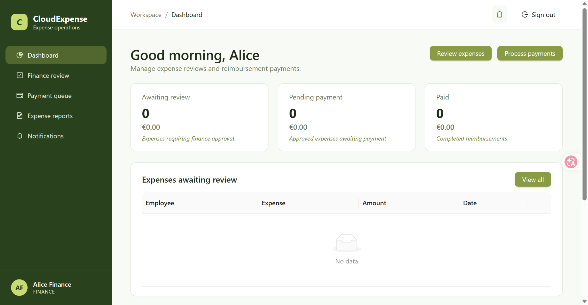

# CloudExpense

A full-stack enterprise expense management application that models an end-to-end reimbursement workflow across employees, managers, and finance teams.

CloudExpense enables employees to submit expense claims with receipts, managers to review and approve requests, and finance teams to perform final reviews and record reimbursement payments.

## Live Demo

**Application:** [http://13.60.249.170](http://13.60.249.170)

### Demo Accounts

| Role | Email | Password |
| --- | --- | --- |
| Employee | `employee@test.com` | `password123` |
| Manager | `manager@test.com` | `password123` |
| Finance | `finance@test.com` | `password123` |

> The application is deployed on AWS EC2. The demo environment uses HTTP and is intended for portfolio demonstration purposes only.

---

## Features

### Employee

- Create and edit expense requests
- Save expenses as drafts
- Upload and view receipt attachments
- Submit expenses for approval
- Track reimbursement status
- View personal expense reports
- Receive workflow notifications

### Manager

- View expenses submitted by team members
- Review expense details and receipts
- Approve or reject expense requests
- Add comments when making approval decisions
- View team expense reports
- Receive notifications for pending approvals

### Finance

- Review manager-approved expenses
- Approve or reject expenses during finance review
- Manage expenses awaiting payment
- Record reimbursement payments
- View expense reports and payment history
- Receive finance workflow notifications

---

## Expense Workflow

CloudExpense implements a multi-stage expense approval workflow:

```text
DRAFT
  |
  | Employee submits
  v
SUBMITTED
  |
  | Manager approves
  v
MANAGER_APPROVED
  |
  | Finance approves
  v
FINANCE_APPROVED
  |
  | Finance records payment
  v
PAID
```

An expense can be rejected during either the manager or finance review stage. Rejection comments provide context to the employee and support a clear audit trail.

---

## Screenshots

> Add the screenshots below under `docs/screenshots/` to enable the preview images.

### Login



### Employee Workspace



### Manager Workspace



### Manager Approval



### Finance Workspace



---

## Architecture

```text
Browser
  |
  v
Nginx / React frontend
  |
  v
Spring Boot REST API
  |
  v
PostgreSQL database
```

The application is containerised with Docker Compose. Nginx serves the React single-page application and routes API requests to the Spring Boot backend, which owns business rules, authorization, persistence, and workflow state transitions.

---

## Tech Stack

| Area | Technologies |
| --- | --- |
| Frontend | React, JavaScript, HTML, CSS |
| Backend | Java, Spring Boot, Spring Security, REST APIs |
| Authentication | JWT-based authentication and role-based authorization |
| Database | PostgreSQL |
| Database migrations | Flyway |
| File handling | Receipt upload and attachment management |
| Infrastructure | Docker, Docker Compose, Nginx, AWS EC2 |
| CI/CD | GitHub Actions |

---

## Backend Design

The backend is organised around business capabilities rather than a single generic CRUD layer. Core modules include:

- **Expense** — expense creation, editing, submission, and status tracking
- **Approval** — manager review decisions and comments
- **Finance** — finance review and payment-ready workflows
- **Payment** — reimbursement payment records and history
- **Receipt** — uploaded receipt attachment handling
- **Notification** — workflow-driven user notifications
- **Dashboard** — role-specific operational summaries
- **Report** — personal, team, and finance reporting views

This separation keeps workflow logic explicit and makes responsibilities easier to evolve as the system grows.

---

## Database Management

PostgreSQL stores users, expenses, approval decisions, payments, notifications, and related workflow data.

Database schema changes are versioned with Flyway migrations, enabling consistent local, CI, and deployed environments. Workflow-related records preserve the history needed to trace an expense from submission through reimbursement.

---

## CI/CD

GitHub Actions is used to automate the delivery pipeline. A typical pipeline validates the application by building the frontend and backend, running automated checks, and packaging the services for deployment.

The deployment environment runs the application as Docker Compose services on AWS EC2, keeping the frontend, backend, and database configuration reproducible.

---

## Running Locally

### Prerequisites

- Docker and Docker Compose
- Git

### Start the application

```bash
git clone <your-repository-url>
cd CloudExpense
docker compose up --build
```

Once the containers are running, open the frontend at the URL configured by the Compose setup (commonly `http://localhost`).

### Stop the application

```bash
docker compose down
```

> Configure environment variables and any required secrets for your local environment before starting the services. Do not commit real credentials to the repository.

---

## API Documentation

The backend exposes RESTful endpoints for authentication, expenses, approvals, finance review, payments, receipts, notifications, dashboards, and reports.

When the backend is running locally, consult the project API documentation endpoint or the controller definitions for the available routes and request formats.

---

## Security

- JWT authentication protects API access.
- Role-based authorization separates Employee, Manager, and Finance responsibilities.
- Workflow actions are enforced on the server so users can only perform transitions allowed for their role.
- Receipt and expense access is scoped to the appropriate user and workflow context.
- Sensitive configuration should be supplied through environment variables or deployment secrets.

---

## Deployment Strategy

CloudExpense is deployed on an AWS EC2 instance using Docker Compose:

```text
Internet
  |
  v
AWS EC2
  |
  v
Docker Compose
  |-- Nginx + React frontend
  |-- Spring Boot backend
  `-- PostgreSQL database
```

This approach provides a straightforward, reproducible deployment for a portfolio environment. For production use, the application should be served over HTTPS, credentials should be managed with a dedicated secrets service, and the database should use managed backups and monitoring.

---

## Future Improvements

- Add email notifications for approval and payment events
- Add pagination, filtering, and export options to reporting
- Introduce richer audit logging for workflow changes
- Add automated unit, integration, and end-to-end test coverage
- Serve the public demo through HTTPS with a domain name
- Move production data to a managed database service with automated backups
- Add observability through structured logs, health checks, and metrics

---

## Author

Built by **Colin** as a full-stack software engineering portfolio project.

---

If you found this project useful, feel free to explore the live demo or connect with the author.
